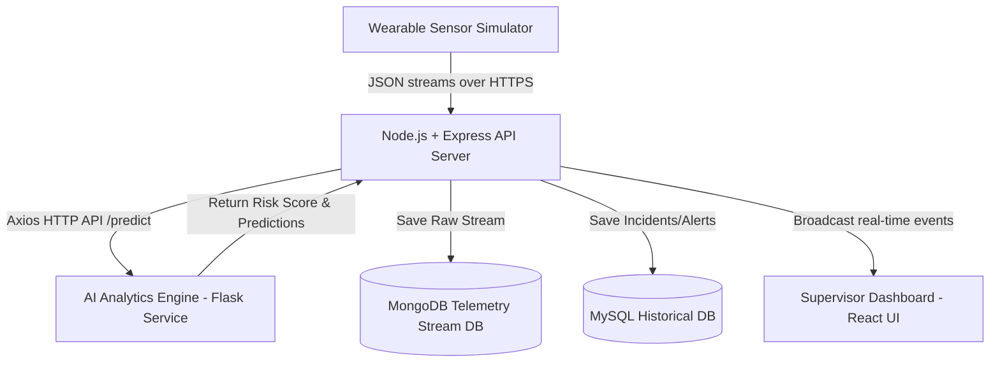

# 🛡 SafeSphere: AI-Powered Predictive Worker Safety Platform

SafeSphere is a real-time safety monitoring and risk mitigation platform built for industrial sites. By ingesting streaming telemetry from wearable IoT sensors (heart rate, body/ambient temperature, and accelerometer movement), the platform detects hazardous events like falls, thermal stress, vital anomalies, and worker distress. It translates this data into a live supervisor dashboard, firing immediate warnings and logging incidents for historical analytics.

This repository hosts the full implementation across all layers: the **Backend API & Real-time Alerts Engine** (Member 3), the **AI/ML Microservice** (Members 1 & 2), and the **Supervisor Dashboard** (Members 2 & 4).

---

## 🏗 System Architecture

The platform is structured into four distinct layers:



1. **Sensor Ingestion Pipeline**: Ingests high-frequency body heat, ambient temp, heart rate, accelerometer vector, and SOS signals.
2. **AI & Rules Analytics Engine**: Combines machine learning predictions (Fall Detection, HR Anomaly, Heat Stress, Dynamic Risk Score) with a robust rule-based local safety fallback logic on the backend side.
3. **Storage Tier**:
   - **MongoDB (Mongoose)**: Document-store logging the high-volume real-time telemetry stream.
   - **MySQL (Sequelize)**: Relational DB storing supervisor login credentials, worker profiles, and persistent safety alert logs.
4. **Dashboard Core (WebSockets)**: Streams worker vitals and push emergency popup alerts live using **Socket.io**.

---

## 🛠 Technology Stack

**Backend**
- **Runtime**: Node.js (v22+)
- **Web Framework**: Express.js
- **Databases**: MongoDB (telemetry) + MySQL (relational config/logs)
- **ORMs**: Sequelize (MySQL) + Mongoose (MongoDB)
- **Real-time Networking**: Socket.io (WebSockets)
- **Security & Utilities**: JWT (supervisor authentication), Bcrypt.js, Helmet, CORS, Express-Validator
- **Testing Suite**: Jest + Supertest
- **DevOps**: Docker, Docker Compose

**AI / ML Microservice**
- **Runtime**: Python 3 (Flask)
- **ML Libraries**: scikit-learn, joblib, NumPy, PyTorch (for fatigue LSTM)
- **Models**: Fall Detection (SVM), Heart Rate Anomaly (Isolation Forest), Heat Stress (rule-based), Dynamic Risk Engine (Gradient Boosting / weighted-rules fallback)

**Frontend**
- **Framework**: React (Vite)
- **Mapping**: Leaflet.js + React-Leaflet (Risk Map visualization)
- **Charts**: Recharts (Analytics dashboard)
- **HTTP Client**: Axios

---

## 🚀 Getting Started

### Prerequisites
Make sure you have [Node.js](https://nodejs.org/) (v18+), [Python](https://www.python.org/) (3.10+), and [Docker Desktop](https://www.docker.com/products/docker-desktop/) installed on your machine.

### Step 1: Start the backend + databases (Docker Compose)
This boots MySQL, MongoDB, and the Node.js API server fully configured and linked:

```bash
# From the root directory:
docker-compose up --build
```
The services will initialize as follows:
- **Express Backend API**: `http://localhost:5000`
- **MongoDB Database**: `mongodb://localhost:27017`
- **MySQL Database**: `mysql://localhost:3306`

> **Note:** if you run MySQL locally outside Docker (e.g. via MySQL Workbench), stop that service first — both will try to claim port 3306 and the container will fail to start. Either stop your local MySQL service, or change the host-side port mapping in `docker-compose.yml`.

### Step 2: Start the AI/ML microservice

```bash
cd ai_engine
python -m venv venv
venv\Scripts\activate        # Windows
# source venv/bin/activate   # macOS/Linux
pip install -r requirements.txt
pip install flask flask-cors
python app.py
```
The ML service runs on `http://localhost:5001`. The Express backend's `ML_SERVICE_URL` env variable should point here (`http://localhost:5001/predict`).

Visit `http://localhost:5001/` in a browser to confirm all models loaded — a healthy response looks like:
```json
{
  "status": "SafeSphere ML microservice is running",
  "models_loaded": { "fall_detector": true, "hr_anomaly": true, "temp_alert": true, "risk_engine": true }
}
```

### Step 3: Start the frontend dashboard

```bash
cd frontend
npm install
npm run dev
```
Open `http://localhost:5173` in your browser.

### Option: Manual backend setup (without Docker)
If you'd rather run the database servers manually or externally:

1. **Install dependencies**:
   ```bash
   cd backend
   npm install
   ```
2. **Configure environment variables** — create a `.env` file in `backend/` (see `.env.example`):
   ```env
   PORT=5000
   MONGO_URI=mongodb://localhost:27017/safesphere
   DB_HOST=localhost
   DB_USER=root
   DB_PASSWORD=your_mysql_password
   DB_NAME=safesphere
   DB_PORT=3306
   JWT_SECRET=safesphere_jwt_secret_key
   ML_SERVICE_URL=http://localhost:5001/predict
   ```
3. **Start the API server**:
   ```bash
   npm run dev
   ```
4. **Run the test suite**:
   ```bash
   npm test
   ```

---

## 📡 REST API Specifications

All endpoints are prefixed with `/api`.

### 🔑 Authentication (Public)
- **`POST /api/auth/register`**: Registers a supervisor account.
  - **Body**: `{ "name": "John", "username": "admin", "password": "password123" }`
- **`POST /api/auth/login`**: Authenticates a supervisor and returns a JWT token.
  - **Body**: `{ "username": "admin", "password": "password123" }`
  - **Response**: `{ "success": true, "data": { "token": "JWT_STRING", ... } }`

### 👥 Workers Profiles (Protected — JWT Required)
> **Note:** despite earlier docs suggesting otherwise, `GET /api/workers` requires the `Authorization: Bearer <token>` header in practice — confirmed during frontend integration testing.

- **`GET /api/workers`**: Fetch all registered worker profiles.
- **`POST /api/workers`**: Registers a new worker in MySQL.
  - **Body**: `{ "id": "W-005", "name": "Bob", "role": "Scaffolder" }`
- **`PUT /api/workers/:id`**: Update worker info (name, role, or active status).
- **`DELETE /api/workers/:id`**: Deletes a worker profile.

### 📥 Telemetry Ingestion (Public — For Sensor Simulators)
- **`POST /api/sensor-data`**: Submits telemetry readings from wearable devices.
  - **Body**:
    ```json
    {
      "workerId": "W-001",
      "heartRate": 85,
      "bodyTemp": 37.2,
      "envTemp": 26.0,
      "accelerometer": { "x": 0.05, "y": -0.1, "z": 9.81 },
      "sosPressed": false,
      "location": { "lat": 37.7749, "lng": -122.4194 }
    }
    ```
  - **Response**:
    ```json
    {
      "success": true,
      "riskScore": 15,
      "riskLevel": "Low",
      "loggedAlerts": []
    }
    ```

### 🚨 Alert Management (Protected — JWT Required)
- **`GET /api/alerts`**: Returns safety incidents/alerts log. Filters: `resolved` (true/false), `severity` (Low/Medium/High/Critical), `workerId`.
- **`PUT /api/alerts/:id`**: Marks a specific alert as resolved.

### 📊 Weekly Analytics Report (Protected — JWT Required)
- **`GET /api/reports/weekly`**: Synthesizes a safety compliance analytics report covering the last 7 days.
  - **Response shape** (confirmed against the live backend):
    ```json
    {
      "success": true,
      "data": {
        "timeframe": "Last 7 Days",
        "totalIncidents": 5,
        "breakdownByType": { "Anomaly": 2, "Heat Stress": 2, "SOS": 1 },
        "breakdownBySeverity": { "High": 4, "Critical": 1 },
        "trend": [{ "date": "2026-06-28", "count": 5 }],
        "highestRiskWorkers": [{ "workerId": "W-001", "name": "John Doe", "count": 3 }]
      }
    }
    ```

### 🧠 AI/ML Microservice (separate service, port 5001)
- **`GET /`**: Health check — confirms all models loaded.
- **`POST /predict`**: Full prediction across fall, heart rate, temperature, and composite risk score.
  - **Body**:
    ```json
    {
      "worker_id": 1, "ax": 0, "ay": 0, "az": 0,
      "bpm": 150, "body_temp": 39.3, "env_temp": 32, "humidity": 55,
      "zone_hazard": 1.0, "sos_pressed": false
    }
    ```
- **`GET /risk-score`**: Simplified `{score, level}` response, query-param based — convenient for quick testing.

---

## 🛑 Fallback Safety Rules Engine (Backend)

If the ML microservice (`ML_SERVICE_URL`) is offline, the Express backend executes its own embedded safety analysis as a fallback:

| Safety Event | Triggering Condition | Outcome | Action |
| :--- | :--- | :--- | :--- |
| **SOS Emergency** | `sosPressed === true` | `Critical` Risk (Score: 100) | Immediate socket alert broadcast & MySQL logged incident |
| **Potential Fall** | accel magnitude > 25.0 m/s² or < 1.5 m/s² | `Critical` Risk (Score: 90) | Socket alert broadcast & MySQL logged incident |
| **Vital Anomaly** | HR > 120 BPM or < 50 BPM | `High` Risk (Score: 80) | Socket alert broadcast & MySQL logged incident |
| **Heat Stress** | Body Temp > 38.5°C | `High` Risk (Score: 85) | Socket alert broadcast & MySQL logged incident |
| **Fatigue Alert** | Body Temp > 37.8°C and HR > 100 BPM | `Medium` Risk (Score: 50) | Socket alert broadcast & MySQL logged incident |

> **Known issue (flagged, not yet resolved):** the ML microservice's fall detection threshold can register a false positive at rest, since resting accelerometer gravity (~9.8 m/s² on one axis) exceeds the model's raw threshold of 4.0. The frontend/ML service currently defaults unsent axis values to 0 as a workaround; the underlying model calibration is still pending a fix. Similarly, the dynamic Risk Engine's current weights can under-escalate a single severe signal (e.g. a confirmed fall or combined cardiac+heat event scoring only "Medium") — flagged to the model owner, fix pending.

---

## 🗺 Dashboard Features (Frontend)

- **Risk Map** (`pages/RiskMap.jsx`): Leaflet-based map showing each work zone color-coded by live risk level (Low/Medium/High/Critical), aggregated from unresolved worker alerts using a "worst signal wins" rule. Since the backend has no native `zone` field, zones are assigned via a frontend-side worker-to-zone lookup table — see in-file comments for details.
- **Analytics Page** (`pages/AnalyticsPage.jsx`): Charts for incidents over time, alert type breakdown, severity breakdown, and a highest-risk-workers ranking — all pulled live from `GET /api/reports/weekly`.
- **CCTV Panel** (`components/CCTVPanel.jsx`): A 4-slot camera grid stub reserving layout space for live video feeds. Not yet wired to real camera hardware — out of scope for this stage.

---

## 🛜 Real-time WebSockets
Socket.io clients connecting to the server root receive:
- **`health-update`**: Standard vitals updating every worker card.
- **`alert`**: Urgent warning popups triggered by critical readings or SOS activations.

---

## 👥 Repository Branching Strategy
This project uses per-developer branches rather than a strict `feature-*` convention:
- `main`: Integration branch — features get merged here via Pull Request once reviewed.
- `Kriti`, `Ankit`, `Pranav`, `Savy`: individual developer working branches, merged into `main` via PR.

---

## 📂 Project Structure

```
SAFESPHERE/
├── ai_engine/          # Python Flask ML microservice (Members 1 & 2)
│   ├── app.py          # Flask server entry point
│   ├── models/         # Fall, HR, temp, risk engine, fatigue model code
│   └── requirements.txt
├── backend/            # Node.js + Express API server (Member 3)
│   ├── controllers/
│   ├── models/         # Sequelize (MySQL) + Mongoose (MongoDB) schemas
│   ├── routes/
│   └── services/
├── frontend/           # React dashboard (Members 2 & 4)
│   └── src/
│       ├── components/ # Reusable UI pieces (CCTVPanel, etc.)
│       ├── pages/       # Full views (RiskMap, AnalyticsPage)
│       ├── services/    # API call helpers
│       ├── context/     # Shared app state (auth, etc.)
│       └── hooks/        # Custom React hooks
├── docs/                # Project documentation, schema reference
└── docker-compose.yml   # One-command local environment setup
```

---

## 🐞 Known Issues / Open Items

- Fall detection model can false-positive on resting gravity readings (see Fallback Rules section above) — fix pending from model owner.
- Dynamic Risk Engine weighting can under-escalate single severe signals to "Medium" instead of "High"/"Critical" — flagged, fix pending.
- Fatigue prediction model exists in scaffold form but is not yet trained or wired into the live `/predict` endpoint, since it requires historical time-series data per worker that isn't tracked yet.
- `RiskMap.jsx`'s worker-to-zone mapping is currently a manually maintained lookup table on the frontend, since the backend has no native `zone` field on workers.
