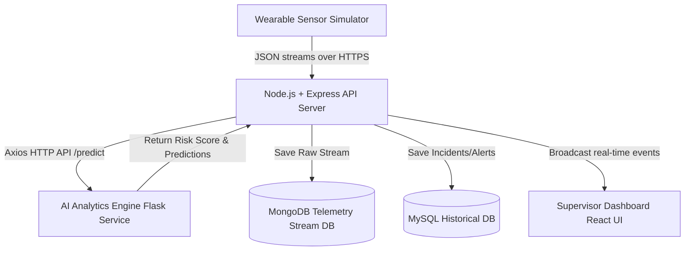

# 🛡️ SafeSphere: AI-Powered Predictive Worker Safety Platform

SafeSphere is a real-time safety monitoring and risk mitigation platform built for industrial sites. By ingesting streaming telemetry from wearable IoT sensors (heart rate, body/ambient temperature, and accelerometer movement), the platform detects hazardous events like falls, thermal stress, vital anomalies, and worker distress. It translates this data into a live supervisor dashboard, firing immediate warnings and logging incidents for historical analytics.

This repository hosts the full implementation of the **SafeSphere Backend API & Real-time Alerts Engine** (built under Member 3 tasks).

---

## 🏗️ System Architecture

The platform is structured into four distinct layers:



1. **Sensor Ingestion Pipeline**: Ingests high-frequency body heat, ambient temp, heart rate, accelerometer vector, and SOS signals.
2. **AI & Rules Analytics Engine**: Combines machine learning predictions (Fall Detection, HR Anomaly, Fatigue) with a robust rule-based local safety fallback logic.
3. **Storage Tier**:
   - **MongoDB (Mongoose)**: Document-store logging the high-volume real-time telemetry stream.
   - **MySQL (Sequelize)**: Relational DB storing supervisor login credentials, worker profiles, and persistent safety alert logs.
4. **Dashboard Core (WebSockets)**: Streams worker vitals and push emergency popup alerts live using **Socket.io**.

---

## 🛠️ Technology Stack (Backend)

- **Runtime**: Node.js (v22+)
- **Web Framework**: Express.js
- **Databases**: MongoDB (telemetry) + MySQL (relational config/logs)
- **Object Relational/Document Mappers**: Sequelize (MySQL) + Mongoose (MongoDB)
- **Real-time Networking**: Socket.io (WebSockets)
- **Security & Utilities**: JWT (supervisor authentication), Bcrypt.js (password cryptography), Helmet (HTTP header security), CORS, and Express-Validator (payload checking).
- **Testing Suite**: Jest + Supertest (unit & integration testing)
- **DevOps**: Docker, Docker Compose

---

## 🚀 Getting Started

### Prerequisites
Make sure you have [Node.js](https://nodejs.org/) (v18+) and [Docker Desktop](https://www.docker.com/products/docker-desktop/) installed on your machine.

### Option 1: Quick Start via Docker Compose (Recommended)
This boots MySQL, MongoDB, and the Node.js API server fully configured and linked:

```bash
# From the root directory:
docker-compose up --build
```
The services will initialize as follows:
- **Express Backend API**: `http://localhost:5000`
- **MongoDB Database**: `mongodb://localhost:27017`
- **MySQL Database**: `mysql://localhost:3306`

---

### Option 2: Manual Development Setup
If you want to run the database servers manually or externally, follow these instructions:

1. **Install Dependencies**:
   ```bash
   cd backend
   npm install
   ```

2. **Configure Environment Variables**:
   Create a `.env` file in the `backend/` directory (see [.env.example](file:///c:/Users/erpra/OneDrive/Desktop/SAFESPHERE/backend/.env.example)):
   ```env
   PORT=5000
   MONGO_URI=mongodb://localhost:27017/safesphere
   DB_HOST=localhost
   DB_USER=root
   DB_PASSWORD=your_mysql_password
   DB_NAME=safesphere
   DB_PORT=3306
   JWT_SECRET=safesphere_jwt_secret_key
   ML_SERVICE_URL=http://localhost:5001/predict
   ```

3. **Start the API Server (Development)**:
   ```bash
   npm run dev
   ```

4. **Run the Test Suite**:
   ```bash
   npm test
   ```

---

## 📡 REST API Specifications

All endpoints are prefixed with `/api`.

### 🔑 Authentication (Public)
- **`POST /api/auth/register`**: Registers a supervisor supervisor account.
  - **Body**: `{ "name": "John", "username": "admin", "password": "password123" }`
- **`POST /api/auth/login`**: Authenticates a supervisor and returns a JWT token.
  - **Body**: `{ "username": "admin", "password": "password123" }`
  - **Response**: `{ "success": true, "data": { "token": "JWT_STRING", ... } }`

### 👥 Workers Profiles (Protected - JWT Required)
- **`GET /api/workers`**: Fetch all registered worker profiles.
- **`POST /api/workers`**: Registers a new worker in MySQL.
  - **Body**: `{ "id": "W-005", "name": "Bob", "role": "Scaffolder" }`
- **`PUT /api/workers/:id`**: Update worker info (name, role, or active status).
- **`DELETE /api/workers/:id`**: Deletes a worker profile.

### 📥 Telemetry Ingestion (Public - For Sensor Simulators)
- **`POST /api/sensor-data`**: Submits telemetry readings from wearable devices.
  - **Body**:
    ```json
    {
      "workerId": "W-001",
      "heartRate": 85,
      "bodyTemp": 37.2,
      "envTemp": 26.0,
      "accelerometer": { "x": 0.05, "y": -0.1, "z": 9.81 },
      "sosPressed": false,
      "location": { "lat": 37.7749, "lng": -122.4194 }
    }
    ```
  - **Response**:
    ```json
    {
      "success": true,
      "riskScore": 15,
      "riskLevel": "Low",
      "loggedAlerts": []
    }
    ```

### 🚨 Alert Management (Protected - JWT Required)
- **`GET /api/alerts`**: Returns safety incidents/alerts log. Filters: `resolved` (true/false), `severity` (Low/Medium/High/Critical), `workerId`.
- **`PUT /api/alerts/:id`**: Marks a specific alert as resolved.

### 📊 Weekly Analytics Report (Protected - JWT Required)
- **`GET /api/reports/weekly`**: Synthesizes a safety compliance analytics report covering the last 7 days.
  - **Response Includes**:
    - Total incidents count.
    - Alert category counts (Fall, Heat Stress, Vital Anomaly, SOS, Fatigue).
    - Severity ratios (Low, Medium, High, Critical).
    - Daily safety incident trends.
    - Highest risk workers ranking.

---

## 🛑 Fallback Safety Rules Engine

If the machine learning service (`ML_SERVICE_URL`) is offline, the backend executes an embedded safety analysis engine:

| Safety Event | Triggering Condition | Outcome | Action |
| :--- | :--- | :--- | :--- |
| **SOS Emergency** | `sosPressed === true` | `Critical` Risk (Score: 100) | Immediate socket alert broadcast & MySQL logged incident |
| **Potential Fall** | $||\vec{A}|| > 25.0 \text{ m/s}^2$ or $< 1.5 \text{ m/s}^2$ | `Critical` Risk (Score: 90) | Socket alert broadcast & MySQL logged incident |
| **Vital Anomaly** | $\text{HR} > 120 \text{ BPM}$ or $< 50 \text{ BPM}$ | `High` Risk (Score: 80) | Socket alert broadcast & MySQL logged incident |
| **Heat Stress** | $\text{Body Temp} > 38.5^\circ\text{C}$ | `High` Risk (Score: 85) | Socket alert broadcast & MySQL logged incident |
| **Fatigue Alert** | $\text{Body Temp} > 37.8^\circ\text{C}$ and $\text{HR} > 100 \text{ BPM}$ | `Medium` Risk (Score: 50) | Socket alert broadcast & MySQL logged incident |

---

## 🛜 Real-time WebSockets
Socket.io clients connecting to the server root receive:
- **`health-update`**: Standard vitals updating every worker card.
- **`alert`**: Urgent warning popups triggered by critical readings or SOS activations.

---

## 👥 Repository Branching Strategy
This project follows a clean repository management strategy:
- `main`: Clean, demo-ready release tag.
- `dev`: Main integration branch where all components merge.
- `feature-*`: Individual developer workspaces (e.g. `feature/m3-backend-endpoints`).
