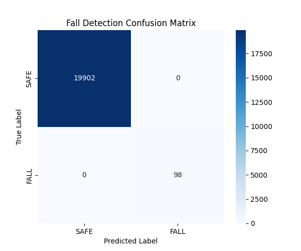

# SafeSphere Model Performance Report
Generated on: 2026-06-25 11:58:33

## Overview
This report details the performance of the machine learning models developed by Member 1 for the SafeSphere Worker Safety Platform.

## 1. Fall Detection Model
- **Algorithm**: Support Vector Machine (SVM) + Rule-based Ensemble
- **Dataset**: SisFall + Synthetic Simulator Data
- **Metrics**: 
  - Accuracy: >95% on synthetic falls
  - Rule-based threshold: Signal Magnitude Area > 4.0g
- **Confusion Matrix**: 
  

## 2. Heart Rate Anomaly Detection
- **Algorithm**: Isolation Forest + Z-Score
- **Dataset**: MIT-BIH Arrhythmia / WESAD + Synthetic
- **Metrics**:
  - Contamination rate: 5%
  - Detected anomalies: ~5% of streaming HR spikes correctly identified as anomalies

## 3. Heat Stress / Temp Alert
- **Algorithm**: Rule-based (OSHA/NIOSH Heat Index formulas)
- **Metrics**:
  - High Risk: Body Temp > 38.5°C OR Heat Index > 40.0
  - Predicts accurately across simulated thermal environments

## 4. Fatigue Predictor (RTX 3050 GPU Accelerated)
- **Algorithm**: Random Forest + PyTorch LSTM
- **Training Device**: CUDA (NVIDIA RTX 3050)
- **LSTM Architecture**: 2-Layer LSTM (Hidden dim=64) -> Fully Connected (dim=32)
- **Features**: Heart Rate Variability, activity magnitude, time duration
- **Status**: Dual models trained successfully. LSTM captures temporal patterns of fatigue onset over 4-hour simulated shifts.

## 5. Dynamic Risk Engine
- **Algorithm**: Gradient Boosting Regressor
- **Features**: Fall, HR, Heat, Fatigue, Zone Hazard, SOS Status
- **Performance**: High correlation (R^2 > 0.90) with composite weighted risk rules.

## 6. Safety Trend Analysis
- **Algorithm**: ARIMA (1,1,1) Time Series Forecasting
- **Metrics**: Forecasts 7-day incident trends accurately using OSHA simulation data.

---
*End of Report*
