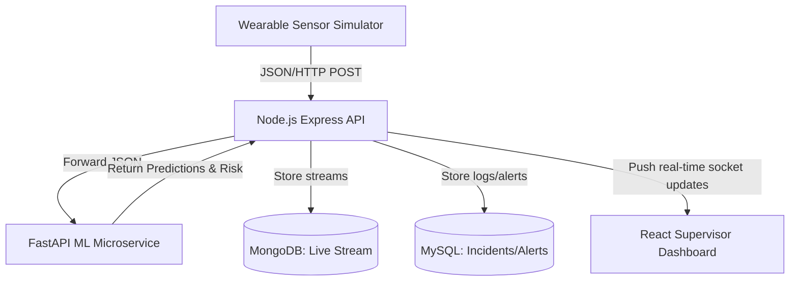

# SafeSphere System Architecture

SafeSphere operates on a 4-layer architecture mapping data streams from sensors to dashboard views:

## Layer-by-Layer Flow

### 1. Hardware/Sensor Simulation (`ai_engine/sensor_simulator.py`)
- Simulates real-time telemetry from worker wearables.
- Features: Heart Rate (BPM), Body Temp (°C), Accelerometer (x, y, z), and a binary SOS flag.
- Periodically posts sensor payloads to backend ingestion endpoint `/api/sensor-data`.

### 2. Backend API Server (`backend/`)
- Acts as the central data broker.
- Processes HTTP requests, handles JWT auth, maps routes to controller functions.
- For incoming sensor streams:
  1. Ingests raw data.
  2. Forwards it to the Python AI service for risk assessment.
  3. Saves telemetry to MongoDB for live retrieval.
  4. Saves alerts and worker state logs to MySQL.
  5. Pushes updates to subscribers via Socket.io.

### 3. AI Analytics Engine (`ai_engine/`)
- Python service exposing predictive endpoints via FastAPI.
- Hosts models:
  - **Fall Detection**: SVM/Threshold model.
  - **Heart Rate Anomaly**: Isolation Forest.
  - **Heat Stress**: Threshold and rolling average.
  - **Fatigue Prediction**: Time-series classifier.
  - **Risk Engine**: Multivariable risk evaluation index.

### 4. Supervisor Dashboard (`frontend/`)
- Single Page Application rendering:
  - **Worker Cards**: Real-time health statistics.
  - **Risk Map**: Interactive floor map showing worker status alerts.
  - **Alert Feed**: Slide-in system warnings and high-priority alarms.
  - **Historical Charts**: Chart.js showing worker safety trends over time.
